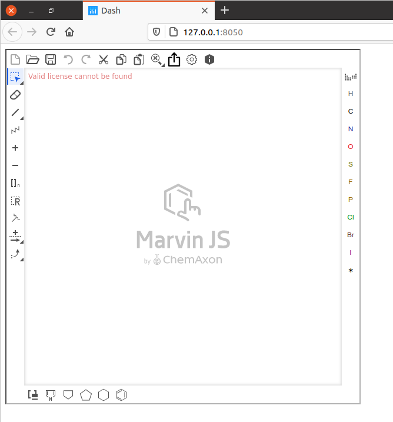

# DashMarvinJS

DashMarvinJS is a Dash component library for ChemAxon MarvinJS integration.

Interaction of MJS with dash is done via the custom upload button on widget panel.



### Usage

Add widget to your dash app layout.

    app.layout = html.Div([
        dash_marvinjs.DashMarvinJS(
           id='set_widget_id_for_callbacks',
           marvin_url=app.get_asset_url('mjs/editor.html'),
           marvin_width='600px',
           marvin_height='600px'
        )
    ])

ChemAxon MJS require manual download. After possible two scenario for setup:
* Custom host:port/url/to/mjs/editor.html. For example by using nginx static files hosting . Note to correctly setup cross-domain headers on server!
* Serve mjs distributive by dash app itself. Place mjs distributive into `assets` folder near to `entry_point.py` and pass `marvin_url=app.get_asset_url('mjs_distro/editor.html')`. See details of assets directory customization in Dash and Flask documentation.

For button customization pass `marvin_button` argument with `{'name' : string, 'image-url' : 'valid html img url', 'toolbar' : 'see MarvinJS documentation (N, W, ...)'}`

Button pressing call callback on python side. Drawn structure available in `download` attribute. Callback can return modified structure back to widget through `upload` attribute.
Input and output structures encoded in MRV format.

    @app.callback(Output('set_widget_id_for_callbacks', 'upload'), [Input('set_widget_id_for_callbacks', 'download')])
    def cb(input):
       ...
       return output

See `usage.py` with demo.


### Install from PyPI

    pip install dash_marvinjs

### Build from sources

1. Create a virtual env and activate.
    ```
    virtualenv venv
    . venv/bin/activate
    ```
2. Install python packages required to build components.
    ```
    pip install -r requirements.txt
    ```
3. Install npm packages
    ```
    npm install
    ```
4. Build your code:
    ```
    npm run build
    ```
5. Create a Python tarball
    ```
    python setup.py sdist
    ```
    This distribution tarball will get generated in the `dist/` folder
